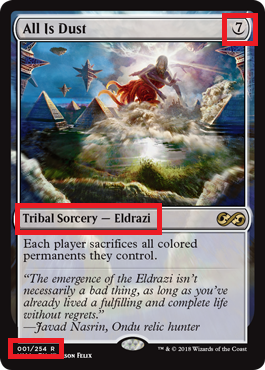
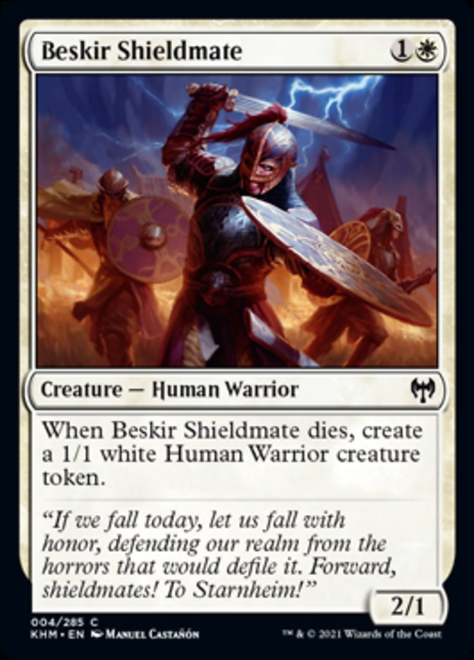
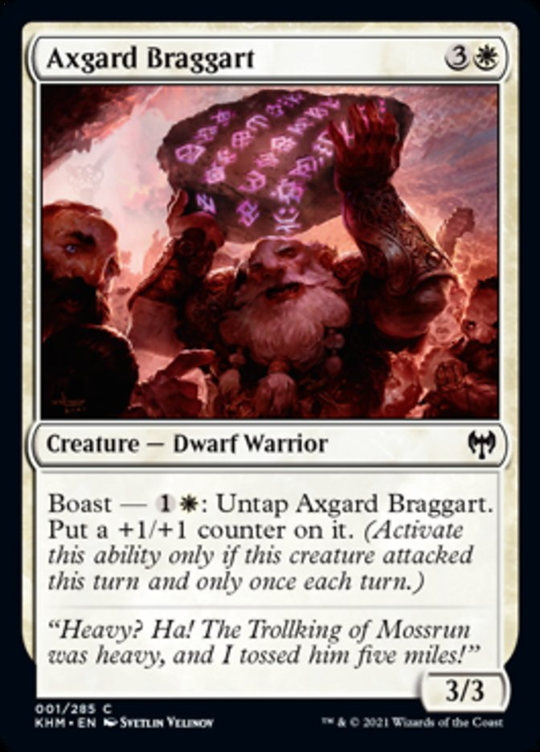
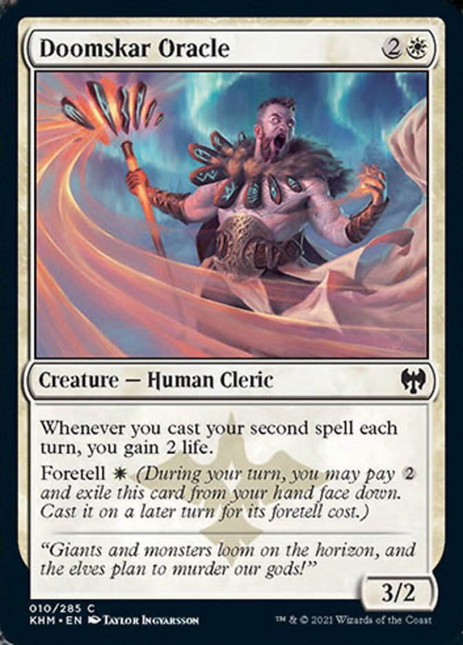
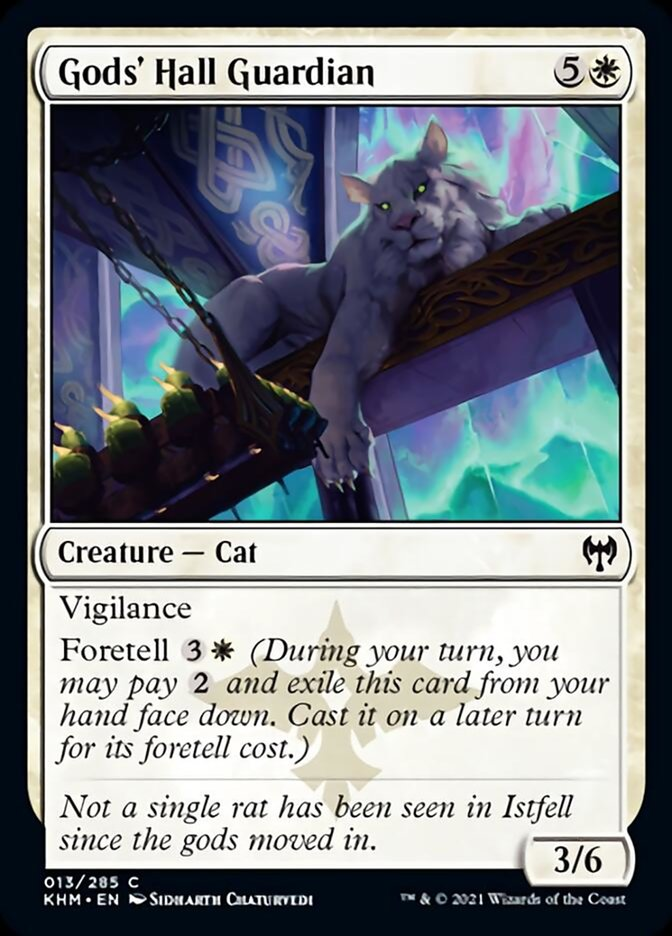
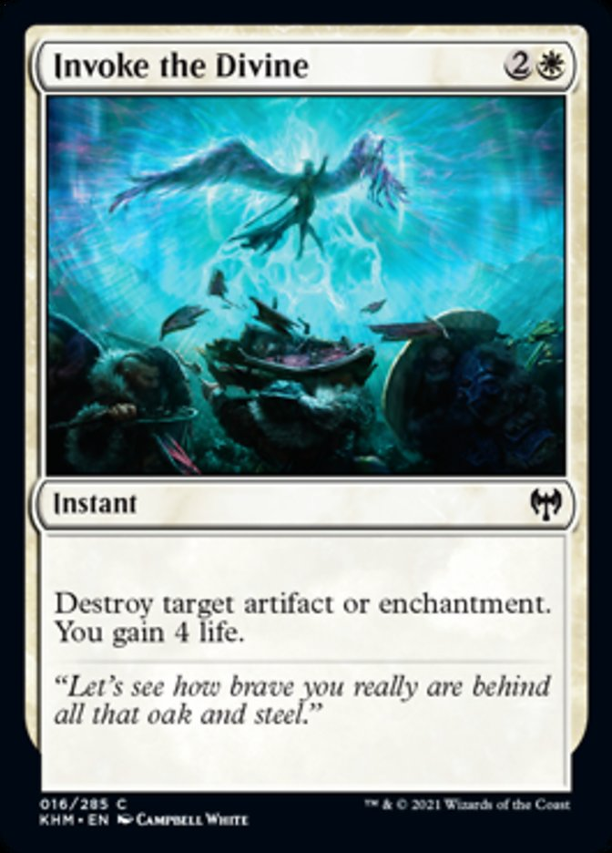

## Arvore_Vermelho-Preto
Trabalho sobre Arvore Rubro negra para materia de AEDS II

## Objetivo
Este trabalho tem como objetivo usar a ***Arvore rubo negra*** para organizar coleçoes de **Magic: The Gathering** facilitando assim a vida de lojistas que tem problemas com controle de estoque


## Execução
Sera usado cada bloco de cartas (chamados de edições) em Json, em cada edição as cartas sao numeradas (canto inferior esquerdo) e sera usado isso para coloca-las em arvores. Alem disso cada carta tem suas cores(canto superior direito e bordas), tipos(linha no meio da carta) e custos(canto superior direito) fazendo assim algo que pode ser encontrado com varios tipos de buscas.



## Arvore

Uma Arvore rubo negra deve seguir algumas regras:
```
 1-Um nó é vermelho ou preto.
 2-A raiz é preta. 
 3-Todas as folhas(null) são pretas.
 4-Ambos os filhos de todos os nós vermelhos são pretos.
 5-Todo caminho de um dado nó para qualquer de seus nós contem o mesmo número de nós pretos.
```
Com isso temos uma Arvore rubro negra balanceada

## Simulação de Inserção

Sera simulado a inserção de 5 cartas pelos seus indices na arvore:

Este sera o primeiro nó preto e como visto no canto inferior seu numero é o 4:




```
                    4-Beskir Shieldmate (Preto)
```
Segunda carta e agora com o numero 1 e sera vermelha:


```
                    4-Beskir Shieldmate (Preto)
                    /
    1-Axgard Braggart(Vermelho)

```
A terceira sera colocada como filha do nó inicial e sera vermelha tambem:


```
                    4-Beskir Shieldmate (Preto)
                    /                       \
    1-Axgard Braggart(Vermelho)    10-Doomskar_oracle.jpg(Vermelho)

```
A quarta sera a de numero 13 como filha direita da ultima inserida, ela ira trocar a cor das anteriores dela ficando assim vermelha:


```
                    4-Beskir Shieldmate (Preto)
                    /                       \
    1-Axgard Braggart(Preto)    10-Doomskar_oracle.jpg(Preto)
                                                        \
                                            13-Gods_hall_guardian(vermelho)

```
Por fim sera colocada a 16 que fará o 13 virar o nó direito do nó inicial rotacionando a arvore:

```
                    4-Beskir Shieldmate (Preto)
                    /                       \
    1-Axgard Braggart(Preto)    13-Gods_hall_guardian(Preto)
                                    /                 \
        10-Doomskar_oracle.jpg(Vermelho)      16-Invoke_the_Divine(Vermelho)

```

## Conclusao

Esse algoritmo funciona como um banco de dados estruturado como uma arvore, ele poderia ajudar na busca mas em questao de usabilidade um banco nao feito numa arvore poderia se mostrar mais eficiente.

## Referencias
 -Cormen, Thomas H, et al. Introduction to Algorithms. 2009.
 -Árvore rubro-negra – Wikipédia [https://pt.wikipedia.org/wiki/%C3%81rvore_rubro-negra]
 -MTGJSON [https://mtgjson.com/]

